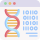

:sd_hide_title:

About
=====

Hi, I'm Nicolas de Montigny
===========================

.. image:: /img/profile.jfif
   :align: left
   :width: 25%
   :class: sd-rounded-circle

.. grid:: 1
      
   .. grid-item::
      :class: sd-border-bottom

      A bit about me...

   .. grid-item::
      :class: sd-border-bottom

      💼 IT solutions analyst @ `Héma-Québec <https://www.hemaquebec.ca/>`__
   
   .. grid-item::
      :class: sd-border-bottom

      🔬 Former Research Scientist @ `Diallolab <https://diallolab.com/>`__
   
   .. grid-item::
      :class: sd-border-bottom

      🎓 M.Sc graduate in Computer Sciences @ `UQAM <https://etudier.uqam.ca/programme?code=2283>`__
   
   .. grid-item::

      🎓 DESS graduate in Bioinformatics @ `UQAM <https://etudier.uqam.ca/programme/dess-bio-informatique>`__

.. | My name is Nicolas de Montigny M.Sc., I am a Data Scientist with a dual background in computer science and biological sciences.
.. | Being both a computer scientist and a biologist enables me to understand both worlds and connect them for optimal collaboration and solution design.
.. | My principal interests are described below.

Domains of interests
--------------------

.. grid:: 3

   .. grid-item-card::
      |bioinfoImg| Bioinformatics
      
      * Sustainable development, coding and machine learning practices
      
      * Environmental impact of human practices
      
      * Biological processes forecasting
      
      * Climate changes modelization

   .. grid-item-card:: 
      |compsciImg| Computer sciences

      * Machine Learning
      
      * Cloud Computing
      
      * Tool development for biological data analysis

   .. grid-item-card:: 
      |biologyImg| Biological sciences
      
      * Environment & Climate changes
      
      * Human genomics
      
      * Metagenomics
      
      * One Health principle

.. Projects I have worked on
.. -------------------------

.. toctree::
   :maxdepth: 1
   :hidden:
   :caption: Site Contents:

   genomics
   interfaces
   training
   cv-info

.. Bioinformatics icons created by Freepik - Flaticon

.. Computer icons created by vectorsmarket15 - Flaticon

.. Biology icons created by Eucalyp - Flaticon
